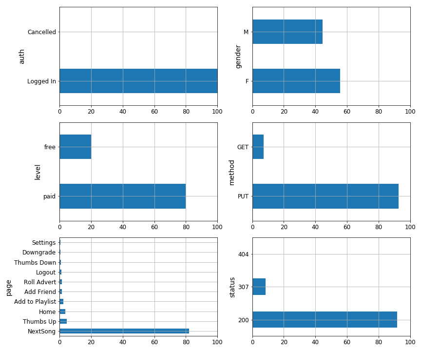
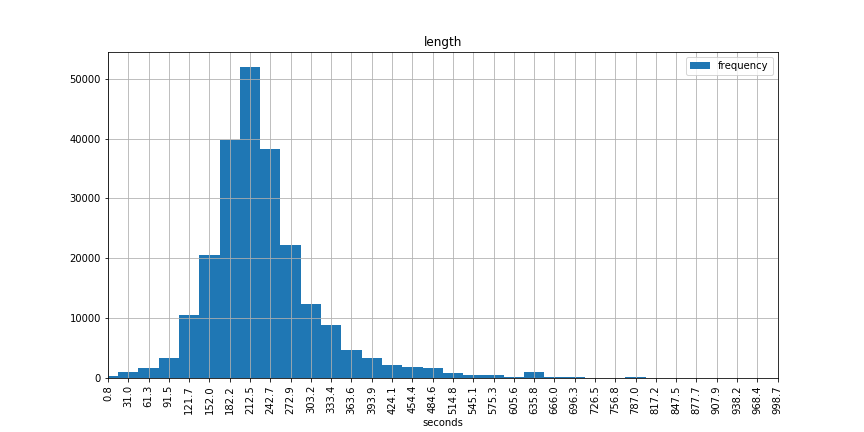
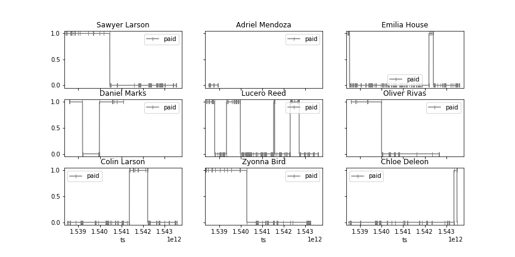
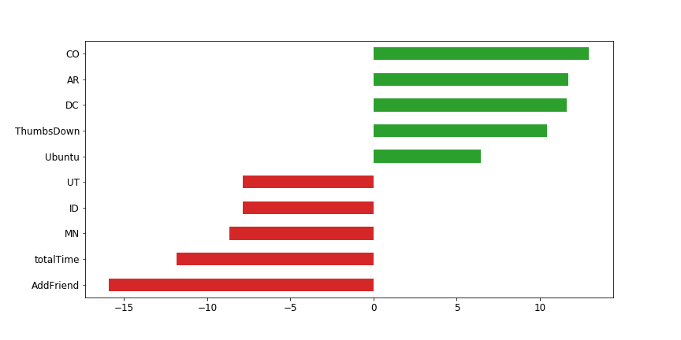
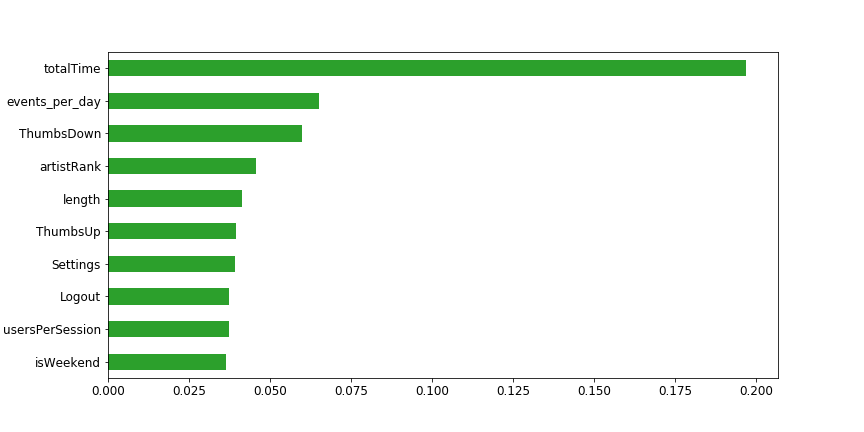

# Sparkify

## Project Definition
### Project Overview
A common problem in service providing companies (e.g. Spotify) is the prediction of 
[churn](https://en.wikipedia.org/wiki/Customer_attrition). Churn is, simply put, the loss of clients and it is a very 
common KPI to track. Predicting churn allows the companies to take action to avoid the loss of customers before it happens, 
helping to increase their customer base.

### Problem Statement

An example dataset of events will be used to create a model that will predict churn in users. Each entry in the data set 
is an event such as:
* Listening to a song.
* Adding a friend.
* Logging in.

The dataset provided is a small sample (128 MB) of a full dataset available in AWS (12 GB). In real world applications 
the size of the dataset can be much larger which motivates the use of Spark for data handling and model training.

Churn will be defined as __customer that has visited the cancellation confirmation page__.

The tasks of this project are:
1. Load large datasets into Spark and manipulate them using SparkSQL or Spark dataframes.
2. Using Spark dataframes engineeer features that will help in the prediction of churn.
3. Use Spark ML to build and tune machine learning models that will predict churn.

### Metrics
Since we are dealing with churn, our labels will be heavily skewed. The number of users that churn represent around 10 % 
of all our users. For such problems accuracy is not a good metric since the model "user never churns" will score 90%.

To be able to determine how good our model is we will need to look at precision, recall and F1 score:
* Precision: How many of all the predicted churns are actually correct.
* Recall: How many of the churned customers did the model predict.
* F1: Harmonised average of precision and recall.
As we can see these metrics revolve around the churned customers, either predicted or actual.
Precision will be more useful when Type I errors are costly and recall will be better in cases where TypeII errors are 
undesirable. In absence of more information about the measures that will be taken based on our model, a fair compromise 
can be found by using __F1__.

## Analysis
### Data Exploration
Our data is a sample of an event log. In our 128 MB sample data we have 286500 events of 255 users with 18 features each. 
The data extends between October and November 2018.
The following features are present:

* __Artist__: Artist of the song being played, if the event does not concern listening to a song the field is null
* __auth (authentication)__: Whether the user Logged in or Logged out, cancelled or guest.
* __firstName__: First name of the user. Null if user has not logged in
* __gender__: Gender of the user (M/F), null if the user has not logged in
* __itemInSession__: Number of events so far in the session. Starts in 0
* __lastName__: Last name of the user. Null if user has not logged in
* __length__: Time in seconds that a song has been played. if the event does not concert listening to a song the field 
is null.
* __level__: Whether the user has a paid subscription of free. (paid/free)
* __location__: Location of the user
* __page__: Page where the event took place. The following pages exists in the dataset: Cancel, Submit Downgrade, 
Thumbs Down, Home, Downgrade, Roll Advert, Logout, Save Settings, Cancellation Confirmation, About, Submit Registration, 
Settings, Login, Register, Add to Playlist, Add Friend, NextSong, Thumbs Up, Help, Upgrade, Error, Submit Upgrade
* __registration__: Registration number associated with each user
* __sessionId__: Number of the session initiated
* __song__: Name of the song being played.
* __status__: http status code (200, 307, 404)
* __ts__: Timestamp in ms
* __userAgent__: Information about the device and browser accessing the data.
* __userId__: Id associated with each user

And here is an example of data:

|              artist|     auth|firstName|gender|itemInSession|lastName|   length|level|            location|
|--------------------|---------|---------|------|-------------|--------|---------|-----|--------------------|
|      Martha Tilston|Logged In|    Colin|     M|           50| Freeman|277.89016| paid|     Bakersfield, CA|
|    Five Iron Frenzy|Logged In|    Micah|     M|           79|    Long|236.09424| free|Boston-Cambridge-...|
|        Adam Lambert|Logged In|    Colin|     M|           51| Freeman| 282.8273| paid|     Bakersfield, CA|

|           page| registration|sessionId|                song|status|           ts|           userAgent|userId|
|---------------|-------------|---------|--------------------|------|-------------|--------------------|------|
|       NextSong|1538173362000|       29|           Rockpools|   200|1538352117000|Mozilla/5.0 (Wind...|    30|
|       NextSong|1538331630000|        8|              Canada|   200|1538352180000|"Mozilla/5.0 (Win...|     9|
|       NextSong|1538173362000|       29|   Time For Miracles|   200|1538352394000|Mozilla/5.0 (Wind...|    30|

There are no duplicate events in our data but there are many rows without a userId. This is because events before login 
are registered, it those cases the user is `''`. Some of those events could be assigned to a user based on the sessionId,
if a session only has one user then all events of that session must belong to that user. However, only 2.9 % of events have
missing userIds and many sessions have more than one user. There is no obvious reason to think that those events are needed
for the purpose of this project and they will therefore be excluded in the rest of this analysis, leaving us with 278154 events.

We can now take a look at how many users share sessions:

|Users per session|Share of sessions [%]|
|---------------|-----|
|              1| 79.8|
|              3|  10.5|
|              4|   3.4|
|              2|  6.3|'

Most of our users do not share sessions with other users (80 %). However a significant amount of sessions are shared.

Another very important property of our data, as already mentioned above, is the number of people that visit the cancellation 
confirmation page

|Visited cancellation confirmation|no. users|
|-----------------|-----|
|              yes|   52|
|               no|  173|

For interest we can also look at the top ranking songs and artists. For our sample dataset this is how our top 5 would look like:
1. You're The One - Dwight Yoakam
2. Undo - Björk
3. Revelry - Kings Of Leon
4. Sehr kosmisch - Harmonia
5. Horn Concerto No. 4 in E flat K495: II. Romance (Andante cantabile) - Barry Tuckwell/Academy of St Martin-in-the-Fields/Sir Neville Marriner

For curiosity you can listen to the top ranking song [here](https://open.spotify.com/track/451F5TM60tR5ec1gOGr1JQ?si=5bUGCoYVSzKj6dgYXCEC6g)

and the top artists are:

1. Kings Of Leon
2. Coldplay
3. Florence + The Machine
4. Dwight Yoakam
5. Björk

As we will see the top artist and song will not be very relevant in our analysis since we will index the songs and artists by popularity.

### Exploratory Visualization
The picture below shows categorical features with less that 25 categories.

Most of our events are paid (80%), there are more events by women than by men and most of the events (>80%) are listening to songs 
(page:NextSong, method:PUT and status:200)

The only numeric feature is length. Other features can be of numeric type but represent a category or a sequential number.
The histogram below shows the distribution of the _length_ feature. There is a minimum length of  0.8s and a maximum value
of 3025s. Those values are clearly outliers in a distribution were the percentiles 0.25 and 0.75 are respectively 205s and 
258s with a median of 222s.

Another interesting feature to look at to understand our data is their paying behaviour, how often they trigger events?
do they change subscription plans?
The plot below shows a sample of 9 random users, on the y axis, whether they are paying (1) or not (0) and each marker 
representing an event.

As we can see there are many kinds on users: some pay and then stop or viceversa, others switch from paid to unpaid  
several times and some always pay or never pay

### Algorithms and techniques
Even tough the dataset we will be working with is only 128MB, the problem can be applied to large datasets that require the use
of distributed, parallel process systems. The system used in this project will be Spark, using the python dataframe API Pyspark.
Since the size of our data is small we will run the spark cluster locally on our machine. 

The whole work, from extracting and transforming data to tuning models will be executed in Spark. However, we will save the 
transformed data ready for training into persistent storage to speed up the process. 

The approach taken in this work is to treat each user as a row of our processed data, with engineered features that define 
that user (e.g. number of events, total time as customer, whether they pay,  etc). Other approaches will be proposed as 
further work.

Churn will be treated as a binary classification problem. Among the Spark classification models, we will limit our 
investigation to three models:

* [Random Forest Classifier](https://spark.apache.org/docs/2.2.0/ml-classification-regression.html#random-forest-classifier)
* [Logistic Regression](https://spark.apache.org/docs/2.2.0/ml-classification-regression.html#logistic-regression)
* [Multilayer Perceptron Classifier](https://spark.apache.org/docs/2.2.0/ml-classification-regression.html#multilayer-perceptron-classifier)

We will tune these models and recommend the model with the highest F1 score (as discussed above).

## Implementation:

### ETL process:
The data in this case is stored in a json file locally in our computer, for larger datasets the data would be loaded probably from cloud storage.
The data will be loaded into a pyspark dataframe by using pysparks session method read.json .

`event_log = spark.read.json('mini_sparkify_event_data.json')`

The transformation of the data is divided in three steps:
1. Cleaning the data
2. Creation of new event based features: one-hot encoding and indexing.
3. Transform event data to user data by aggregating features.
4. Save the transform data to persistent memory

#### 1.Cleaning data:
As discused in the the analysis section above, the events with userIds equal to '' represent only 2.9 % of the events. 
Only a fraction of them could be imputed, the users that do not share accounts. Imputing those and removing the rest would
introduce biases towards users that do not share accounts. They would have visited pages that users that share accounts would 
not have visited for example. For simplicity and consistency I chose to remove these events.

`event_log = event_log.where(event_log.userId != '')`

In this case we doo not have duplicate data is which is not an uncommon problem. Had we had duplicate events we would have 
removed them in this step.

#### 2. Creation of new event based features.
In a first step the following features are created with help of pysparks `udf` and the dataframes `withColumn()` method, 
to extract information from the userAgent feature, the `ua-parser` package was installed:

* os (string): Operating system extracted from the userAgent
* browser (string): Browser used extracted from the userAgent
* paid (integer): 1 or 0 based on the level feature (paid/free)
* state (string): state from location.
* day (int): day of the week the event took place (0 to 6, monday to sunday)
* hour (int): hour of the day the event took place (0 to 23 hr)
* is_female (int): whether the user is female
* cancellation: whether the event page is cancellation confirmation.

We will now one-hot encode the following features:
* 'os' creating features for 'iOS, Linux, Ubuntu, Mac OS X, Windows'
* 'browser' creating features for 'Firefox, Safari, Mobile Safari, IE, Chrome'
* 'page' creating 19 new features.
* 'state' will create a total of 44 new features. Some users have missing state values which will be represented by all
zeros and some have more than one state, so they will be represented by more that one 1.

Day and hour will not be one-hot encoded. It seems unnecessary to encode every hour and day. Instead two new features will
be created based on them:
* 'isWeekend': whether day is Saturday or Sunday.
* 'isAfternoon': whether the event took place between 12 pm and 12 am

Given the large number of different songs and artists, these features will be ranked by popularity using pysparks `StringIndexer()`.

Finally, the usersPerSession feature will be added. This feature shows how many distinct userIds shared a common sessionId.

#### 3. Creating of groupBy features
In this stage the features created in step 2 will be aggregated per user as follows:

* By average: 'isWeekend', 'isAfternoon', 'songRank', 'is_female', 'artistRank', 'usersPerSession', 'length', 'paid', os features, 
 browser features, state features and page_features. The average of user dependent features like 'is_female' or one-hot encodings for state
 will return the either 1 or 0. Others like paid or isAfternoon will return the share events that were paid or during the afternoon. Finally,
 numeric features like songRank or length will return average values for those features (e.g. average ranking of artists listened to, or 
 average song length listened to). Nb: page features 'page_is_cancel' and 'page_is_cacellationConfirmation' are removed at this point. keeping 
 them would defeat the purpose since the label of our data would be present in our predicting features.
 * By maximum: only 'page_is_CancellationConfirmation' and 'ts' will be aggregated this way. max(page_is_CancellationConfirmation) will be
 our Churn value (our label) and max(ts) will be used later on to calculate the time in use of the user.
 * By minimum: Only ts will be calculated to obtain the time in use of the user.
 
 Finally 2 features will be created:
 * the 'totalTime': calculated as the max(ts) - min(ts)
 * 'events per day': calculated as the number of events per user divided by the totalTime.
 
 
#### 4. Saving the transformed data:
So far we have mostly created a DAG that will have to be evaluated. To facilitate the model training and tuning we will 
calculate our features by saving them to persistent memory.
We will first select the features listed below and create a sparse vector using `VectorAssembler()`:

 'avg(isWeekend), avg(isAfternoon), avg(songRank), avg(is_female), avg(artistRank), avg(usersPerSession), avg(length), 
 avg(paid), avg(os_features (Linux, Ubuntu, etc)), avg(browser_features(Safari, IE, etc)), avg(state_features (MI, NV, etc)), 
 avg(page features(Home, Help, etc)), count, totalTime, events_per_day'
 
Our final dataframe to be saved as a parquet file will look as follows:

|            features|label|userId|
|--------------------|-----|------|
|(82,[0,1,2,4,5,6,...|    0|   126|
|(82,[0,1,2,4,5,6,...|    0|   131|
|(82,[0,1,2,3,4,5,...|    0|   140|
|(82,[0,1,2,3,4,5,...|    1|    17|
|(82,[0,1,2,3,4,5,...|    0|100004|

### Modelling and Tuning

Once the transformed data is saved we are ready to train some models. We have created 82 features and 255 users/rows.
The following steps were taken:
1. Split the data into training and test data. 25 % of the data will be used as test data. We will evaluate the trained 
models on that data to determine the best model. Since we have very few positives ( approx. 10 %) we will check that both 
sets have comparable rations of positive labels(churn).

`train, test = df.randomSplit([0.7, 0.3], seed=40) `

2. We need to define appropriate evaluators (`myEvaluator(Evaluator)`), since binary evaluators in pyspark do not fit our needs (F1 score).

3.For each model chose we will crate a pipeline with a min-max scaler and tune that pipeline using pysparks `CrossEvaluator()`. Since we do not have
that much data in this sample 3 folds in the cross evaluator will suffice. The following hyperparameters will be tuned:
* Logistic regression:
    * maxIter, [10, 100, 500]
    * regParam (lambda), [0, 0.4, 0.6, 1]
    * elasticNetParam (alpha), [0, 0.5, 1]
    * standardization , [True, False]
    * aggregationDepth, [2, 3, 4]
* Random Forest Classifier:
    * numTrees, [10, 50, 100]
    * maxDepth, [2, 5, 10, 30]
    * minInstancesPerNode, [1, 2, 5]
* Multilayer perceptron classifier:
    * maxIter: [10, 50, 100]
    * layers: the layers are created in monotonic reducing number of perceptrons with 2 first layers of input size.

## Results and Conclusions

These are the final results of the tuned models:

| Model                          | True Positives | False Positives | True Negatives | False Negatives | Accuracy | Recall | Precision | F1|
|--------------------------------|----------------|-----------------|----------------|-----------------|----------|--------|-----------|---|
|Logistic Regression (LG)             |9|13|38|7|0.70|0.56|0.41|0.47|
|Random Forest Classifier (RFC)       |4|0|51|12|0.82|0.25|1.0|0.4|
|Multilayer Perceptron Classifier (MPC)|10|11|40|6|0.75|0.62|0.48|0.54|

As we can see from the results none of the models are particularly good. The maximum F1-score was obtained with the perceptron classifier (MPC) with 11 layers .
Logistic regression (LR) seems to perform similarly to the MPC scoring lower both on recall and precision. The Random Forest classifier (RFC) 
however was extremely conservative, it only predicted 4 of the 16 churned users. 

Unfortunately, we cannot determine feature importance of the MPC but we can look at the both the LG and the RFC to gain some insight into which 
features seem to matter more for churn.

The picture below shows the top and bottom 5 coefficients of the LR.

 

Interestingly, the state features of CO, AR and DC rank highest. This might suggest that users in those states tend to churn more than other states.
It is risky to draw those conclusions since there are 44 states and 255 users, there are very few users per state which might affect our model.
If the size of our dataset was the size of the sample here investigated we would study the posibility of removing these features, however this work is
meat to also be applied to larger data sets where these features might become relevant again. 

If we ignore the state feature we find that the strongest indicators of churn are ThumbsDown and Ubuntu. It seems quite reasonable to think that people that
usually dislike songs will end up terminating their subscription. The Ubuntu feature sugests that users with Ubuntu are more likely to terminate their subscriptions.

On the other hand, the features that indicate that the users will remain customers are: AddFriend and Totaltime, both very reasonable indicators. This might motivate further
investigations into the social interactions between users and churn. Total time tells us that users that have been clients for a long time will likely remain that way and that there
is a larger risk with new users.

We can now move on to the RFC, the picture below shows the feature importance of the top 10 :

 

As we can see, it relies heavily on total time. Again, this might be due to the small size of our data set. 

The other top ranked features are : events per Day and Thumbs Down which are not very surprising. Active users will probably not
discontinue the service.

### Conclusions and further work

The work here presented shows how features can be engineered from event logs to create data to be used in machine learning 
models to predict customer churn. We defined customer churn as to wheter a user visited the customer Cancellation page.
We used a sample dataset in a local pyspark cluster that can be easily scaled to much large datasets (big data).
From the three ML models trained the Multilayer Perceptron Classifier (MPC) scored highest in the F1 score. One of the drawbacks of MPC 
is the difficulty in explaining the prediction in relation to the features, however we can look at the logistic regressor and the 
Random forest classifier to get some insight as to what features seem to weigh heavier on the prediction of churn.
The logistic regressor top features are related to states, the thumbs down event, the add friend event, the total time and the Ubuntu os.
The random forest classifier top feature is by far total time followed far behind by events per day, thumbs down and artist rank.

The size of our data set is very small, only 255 users have been used to train with cross-validation and test the models, this affects the
ability of the models to generalize and predict, the scores we obtained were rather low, 0.54 F1-score in the MPC. The choice of model
will in the end be chosen on the details of the measures enforced on tentative churn users. Costly measures false positives will motivate the use
of models with high precision (random forest) while costly false negatives will lead to models that maximize recall (MPC or LR).

Aditional approaches to the problem could be investiged, these are some posibilities:

* Create time based features : features for the last n days
* Rolling average features: create window operations back in time for each event and labels of those windows based on churn events forward in time
* Redefine the problem as a regression problem by defining churn as number of days until cancellation.
* investigate other models: decision trees, boosted trees and SVM

At any rate predicting churn seems to be no easy task even with large data sets (example links?). Creating a reliable model 
is a complex job of problem understanding, feature engineering and model tuning. 

